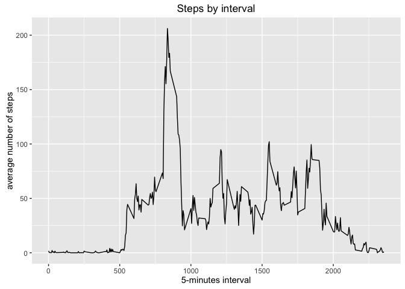

# Reproducible research
by Federico Comesaña  
October 23, 2016  

This assignment makes use of data from a personal activity monitoring device. This device collects data at 5 minute intervals through out the day. The data consists of two months of data from an anonymous individual collected during the months of October and November, 2012 and include the number of steps taken in 5 minute intervals each day.

The variables included in this dataset are:

- **steps:** Number of steps taking in a 5-minute interval (missing values are coded as NA)

- **date:** The date on which the measurement was taken in YYYY-MM-DD format

- **interval:** Identifier for the 5-minute interval in which measurement was taken


## Data

The dataset is stored in a comma-separated-value (CSV) file and there are a total of 17,568 observations in this dataset.

1. Load the data


```r
base <- read.csv("activity.csv", stringsAsFactors = FALSE)
```

2. Process/transform the data (if necessary) into a format suitable for your analysis


```r
library(lubridate, quietly = TRUE, warn.conflicts = FALSE)
base$date <- ymd(base$date)
```

## What is mean total number of steps taken per day?

For this part of the assignment, you can ignore the missing values in the dataset.

1. Calculate the total number of steps taken per day


```r
library(dplyr, quietly = TRUE, warn.conflicts = FALSE)
byday <- base %>%
  group_by(date) %>%
  summarize(steps = sum(steps, na.rm = TRUE))
```

2. Make a histogram of the total number of steps taken each day


```r
library(ggplot2, quietly = TRUE, warn.conflicts = FALSE)
g <- ggplot(byday, aes(steps)) + 
  geom_histogram(bins = 10) +
  labs(title = "Steps by day histogram", x = "number of steps in the day", y = "% of days")
g
```

<!-- -->

3. Calculate and report the mean and median of the total number of steps taken per day


```r
summary <- c(mean = mean(byday$steps), median = median(byday$steps))
summary
```

```
##     mean   median 
##  9354.23 10395.00
```

## What is the average daily activity pattern?

1. Make a time series plot of the 5-minute interval (x-axis) and the average number of steps taken, averaged across all days (y-axis)


```r
byinterval <- base %>%
  group_by(interval) %>%
  summarize(steps = mean(steps, na.rm = TRUE))

g <- ggplot(byinterval, aes(interval, steps)) + 
  geom_line() + 
  labs(title = "Steps by interval", x = "5-minutes interval", y = "average number of steps")
g
```

<!-- -->

2. Which 5-minute interval, on average across all the days in the dataset, contains the maximum number of steps?


```r
maxinterval <- byinterval[which.max(byinterval$steps), ]
as.data.frame(maxinterval)
```

```
##   interval    steps
## 1      835 206.1698
```

## Imputing missing values

Note that there are a number of days/intervals where there are missing values (coded as `NA). The presence of missing days may introduce bias into some calculations or summaries of the data.

1. Calculate and report the total number of missing values in the dataset (i.e. the total number of rows with `NA`s)


```r
nas <- sum(is.na(base))
nas
```

```
## [1] 2304
```

2. Devise a strategy for filling in all of the missing values in the dataset. The strategy does not need to be sophisticated. For example, you could use the mean/median for that day, or the mean for that 5-minute interval, etc. 

**My choice:** I will use the mean.

3. Create a new dataset that is equal to the original dataset but with the missing data filled in.


```r
base2 <- base
for (i in 1:nrow(base2)) {
  if (is.na(base2$steps[i])) {
    base2$steps[i] <- byinterval$steps[byinterval$interval == base2$interval[i]]
  }
}
```

4. Make a histogram of the total number of steps taken each day and Calculate and report the mean and median total number of steps taken per day. Do these values differ from the estimates from the first part of the assignment? What is the impact of imputing missing data on the estimates of the total daily number of steps?


```r
byday2 <- base2 %>%
  group_by(date) %>%
  summarize(steps = sum(steps))

g <- ggplot(byday2, aes(steps)) + 
  geom_histogram(bins = 10) +
  labs(title = "Steps by day histogram", x = "steps each day", y = "% of days")
g
```

<!-- -->

```r
data.frame(original = summary, new = c(mean(byday2$steps), median(byday2$steps)))
```

```
##        original      new
## mean    9354.23 10766.19
## median 10395.00 10766.19
```

**My answer:** The replacement of the missed values of steps with the mean of the average day make the mean converge to the median in a higher value.

## Are there differences in activity patterns between weekdays and weekends?

For this part the `weekdays()` function may be of some help here. Use the dataset with the filled-in missing values for this part.

1. Create a new factor variable in the dataset with two levels – “weekday” and “weekend” indicating whether a given date is a weekday or weekend day.


```r
base2$week <- ifelse(weekdays(base2$date, abbreviate = TRUE) %in% c("Sat", "Sun"), "weekend", "weekday") 
base2$week <- factor(base2$week)
```

2. Make a panel plot containing a time series plot of the 5-minute interval (x-axis) and the average number of steps taken, averaged across all weekday days or weekend days (y-axis).


```r
byinterval2 <- base2 %>%
  group_by(week, interval) %>%
  summarize(steps = mean(steps, na.rm = TRUE))

g <- ggplot(byinterval2, aes(interval, steps)) + 
  geom_line(stat = "identity") + 
  facet_wrap(~week, ncol = 1, nrow = 2) + 
  labs(title = "Steps by interval", x = "5-minutes interval", y = "average number of steps")
g
```

<!-- -->
